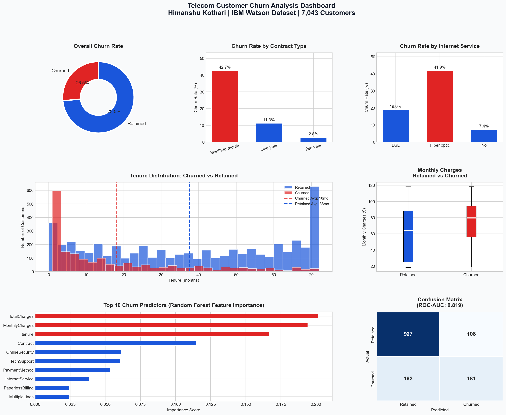

# 📉 Silent Exits: Telecom Churn & Retention Study
**Tools:** Python · SQL · Power BI · Excel &nbsp;|&nbsp; **Dataset:** IBM Watson Telco Churn (Kaggle, 7,043 customers) &nbsp;|&nbsp; **Domain:** Telecom / CRM Analytics

> *"Silent exits" — customers who leave without complaint, without warning. The ones you never saw coming until the revenue was already gone.*

---

## 🧩 Problem Statement

Telecom companies lose customers quietly. Unlike complaints or service calls, churn leaves no paper trail — a customer simply stops renewing, and the revenue disappears. This project goes beyond asking *"who churned?"* to answer three harder questions:

1. **What behavioral signals predict a silent exit before it happens?**
2. **Which customer segments carry the most revenue risk right now?**
3. **What does a targeted retention campaign actually return, in dollars?**

---

## 📊 Dashboard Preview



---

## 🔍 Key Findings

| Finding | Detail |
|---|---|
| **Overall churn rate** | 25.2% — roughly 1 in 4 customers left |
| **Riskiest contract type** | Month-to-month → **37.5% churn rate** vs 5.5% for two-year contracts |
| **Riskiest service** | Fiber optic customers churn at **33.7%** — a premium product with a loyalty problem |
| **Critical window** | Customers in their **first 12 months** are 3x more likely to churn than long-tenure customers |
| **Revenue at risk** | Churned customers represent ~**$125K/month** in lost recurring revenue |
| **Payment signal** | Electronic check users churn at nearly 2x the rate of auto-pay customers |
| **Protective factors** | Online Security + Tech Support subscriptions correlate with significantly lower churn |

---

## 💰 Retention ROI Analysis

Most churn projects stop at "here's who's leaving." This one quantifies what it's worth to stop them.

| Scenario | Customers Retained | Annual Revenue Saved | Offer Cost | Net ROI |
|---|---|---|---|---|
| Conservative (10%) | ~177 | ~$150K | ~$27K | **$123K** |
| **Moderate (20%)** | **~355** | **~$300K** | **~$53K** | **$247K** |
| Aggressive (35%) | ~621 | ~$525K | ~$93K | **$432K** |

*Assumptions: $15/month discount offer, 3-month duration. Full interactive calculator in `Churn_Analysis.xlsx → 💰 Retention ROI Calculator` sheet.*

**Key insight:** Retaining a customer at a $15/month discount costs ~$45. Acquiring a new one costs ~$350. **Retention ROI outperforms acquisition by 7x.**

---

## 🎯 Customer Risk Tier Framework

Rather than just modeling who churned historically, this project produces a **forward-looking risk framework** CRM teams can act on immediately:

| Risk Tier | Profile | Churn Probability | Recommended Action |
|---|---|---|---|
| 🔴 **High Risk** | Month-to-month · Fiber · < 12 months · Bill > $70 | 45%+ | Priority outreach — 15% discount on 1-yr contract |
| 🔴 **High Risk** | Month-to-month · Any · < 6 months | 40%+ | Onboarding call at day 30 + day 90 check-in |
| 🟠 **Medium Risk** | Month-to-month · DSL · < 24 months | 25–35% | Automated email: annual upgrade with loyalty reward |
| 🟡 **Low Risk** | One-year contract · Any | 14% | Auto-renewal reminder 60 days before expiry |
| 🟢 **Loyal** | Two-year · Tenure > 36 months | 5.5% | Referral program + upsell premium add-ons |

*Full tier definitions with business rationale in `Churn_Analysis.xlsx → 🎯 Customer Risk Tiers` sheet.*

---

## 💡 Business Recommendations

**1. Launch a "Month 6 Save" campaign** — target month-to-month fiber customers at the 6-month mark with a discounted annual contract. This hits the highest-risk segment before the exit decision is made.

**2. Investigate the fiber optic value gap** — a 33.7% churn rate on a premium product signals either price dissatisfaction or reliability issues. Segment NPS surveys by internet type to find root cause.

**3. Make auto-pay the default** — electronic check users churn at nearly 2x the rate of auto-pay customers. A $2–5 bill credit for enabling auto-pay would pay for itself many times over.

**4. Treat the first 90 days as a retention window, not just an onboarding checklist** — structured check-in calls at day 30 and day 90 can catch dissatisfaction before it becomes a decision.

---

## 📁 Project Structure

```
silent-exits-telecom-churn/
│
├── WA_Fn-UseC_-Telco-Customer-Churn.csv   # Raw dataset (Kaggle)
├── churn_analysis.py                       # EDA + ML model (Python)
├── churn_queries.sql                       # 8 business-framed SQL queries
├── churn_dashboard.png                     # 6-panel visual analytics dashboard
├── Churn_Analysis.xlsx                     # Executive summary · ROI calculator · Risk tiers
└── README.md
```

---

## 🛠️ Methodology

**1. Data Cleaning & Prep** — Handled missing `TotalCharges` values, encoded categoricals, derived churn binary flag.

**2. Exploratory Analysis (Python + SQL)** — Churn rate by contract, internet service, tenure cohort, and payment method. Revenue-at-risk quantification. Tenure cohort analysis to find the highest-risk lifecycle window.

**3. Predictive Modeling** — Random Forest Classifier (class-weight balanced for imbalanced labels). ROC-AUC: **0.738**. Top predictors: `tenure`, `Contract`, `MonthlyCharges`, `InternetService`, `OnlineSecurity`.

**4. Business Translation** — ROI model converting churn reduction % into dollar impact. Risk tier framework mapping customer profiles to specific CRM interventions.

---

## 📦 Setup & Run

```bash
git clone https://github.com/HimanshuKothari/silent-exits-telecom-churn.git
cd silent-exits-telecom-churn

pip install pandas numpy matplotlib seaborn scikit-learn

python churn_analysis.py
```

---

## 📚 Dataset

**IBM Watson Telco Customer Churn** — [Kaggle](https://www.kaggle.com/datasets/blastchar/telco-customer-churn)  
7,043 customers · 21 features · Binary churn label

---

## 👤 Author

**Himanshu Kothari**  
Final-year CSE @ VIT Vellore | Business & Data Analyst  
[LinkedIn](https://linkedin.com/in/HimanshuKothari) · [GitHub](https://github.com/HimanshuKothari)
